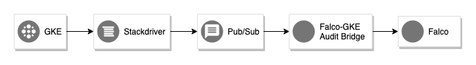

# falco-gke-audit-bridge

Falco has a powerful rule engine to monitor Kubernetes for suspicious activity.
Unfortunally this doesn't work with [Google Kubernetes Engine](https://cloud.google.com/kubernetes-engine/), because GKE is currently not supporting [Dynamic Audit Webhook Backends](https://kubernetes.io/docs/tasks/debug-application-cluster/audit/#dynamic-backend).
GKE sends its audit logs by default to [Stackdriver](https://cloud.google.com/stackdriver/).

This tool will act as a bridge between the GKE Audit logs and Falco. 
It uses Pub/Sub to receive the Audit event from Stackdriver almost in Real-time. 
Then it convert the Audit Event from Stackdriver into an Kubernetes Audit Event and sends it to Falco.

# Setup
**falco-gke-audit-bridge** has a Docker image ready to deploy in Kubernetes. 
* An example of deploying it in Kubernetes can be found in *deploy/kubernetes*.
* To configure the export of the Audit logs from Stackdriver via Pub/Sub to **falco-gke-audit-bridge**, see the Terraform example in *deploy/terraform*.

# Configure the Bridge
The **falco-gke-audit-bridge** can be configured through the following Environment Variables:

| Variable  | Description | Default |
|-----------|-------------|---------|
| LOG_LEVEL | Log level, supported values are: debug,info,warn,error. | info |
| SERVER_PORT | Port for the builtin webserver to listen on. This webserver exposes a health-check and Prometheus metrics endpoint. | 8080 |
| GCP_SERVICE_ACCOUNT | JSON Key of a Google Cloud Service Account for listen on a PubSub Subscription. |  |
| GCP_PUBSUB_SUBSCRIPTION | PubSub Subscription name to listen on for GKE Audit Events. | falco-gke-audit-bridge |
| FALCO_URL | Falco endpoint to send to Audit Events to. | http://falco:8765/k8s-audit |
| RATE_LIMIT_PER_SECOND | Rate limit of events to send to falco per second | 2

# License
MIT